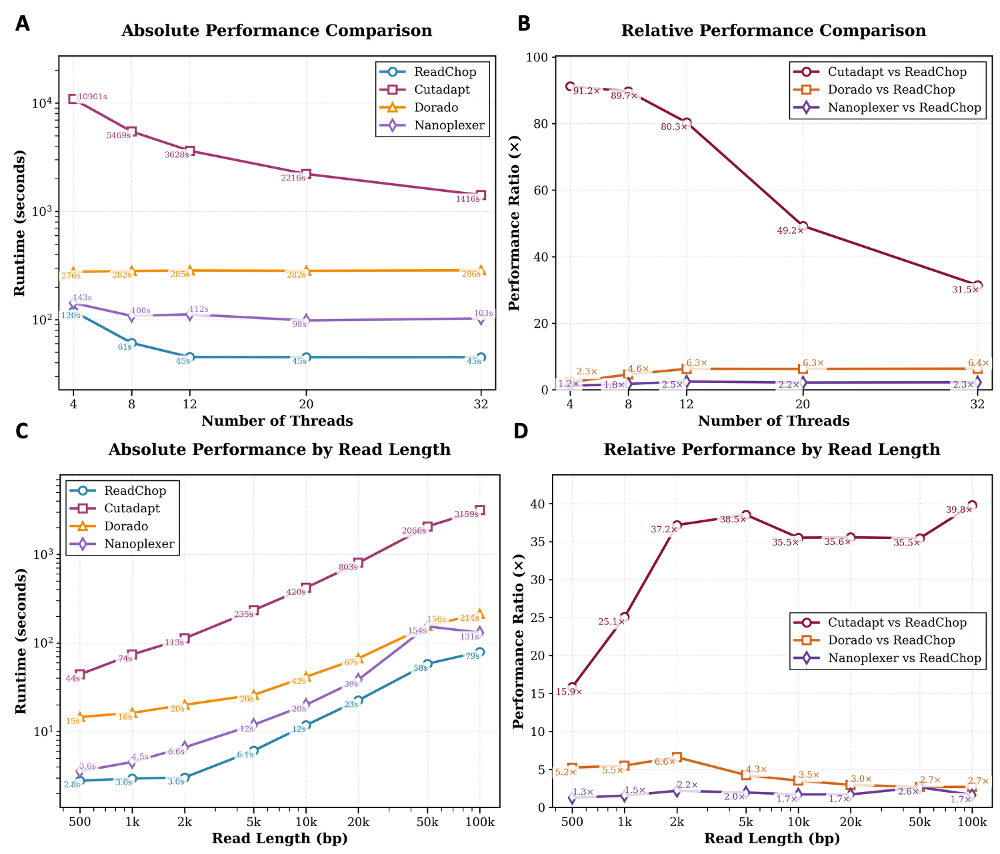
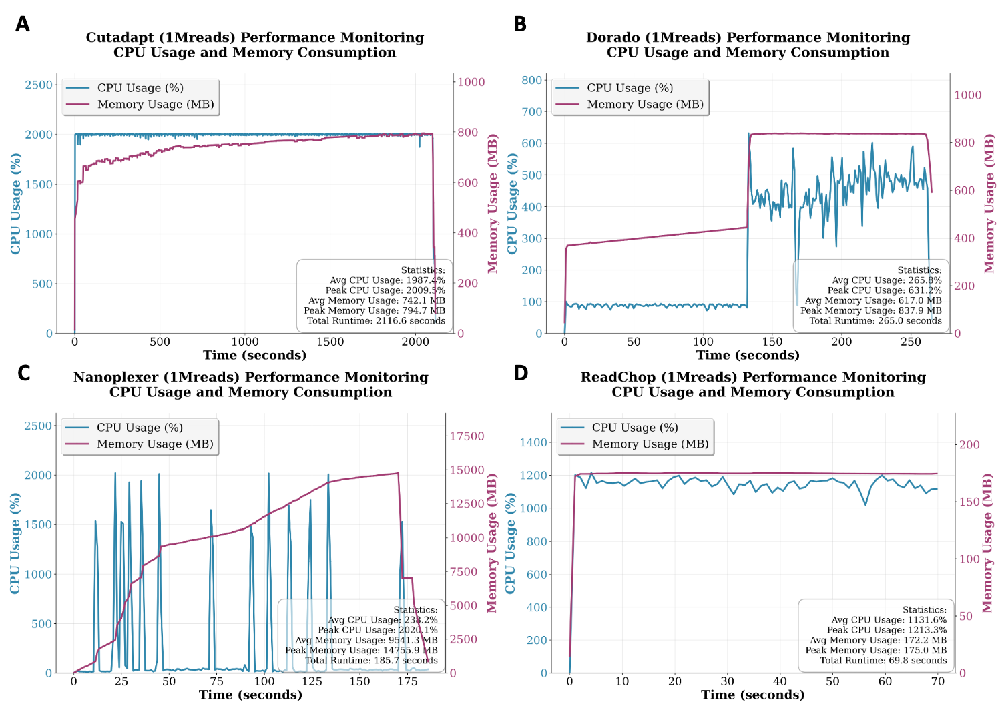

# ReadChop

A high-performance command-line tool for demultiplexing third-generation sequencing long-read FASTQ/GZ files based on specified patterns.

## Overview

ReadChop is designed specifically for third-generation sequencing data, used to split long-read FASTQ/GZ files based on specified patterns. It supports multi-threaded parallel processing, providing efficient sequence demultiplexing and barcode identification capabilities.

**Version:** 1.0.0 
**Author:** jiangchen  
**Email:** cherryamme@qq.com  
**Release Date:** 2025-09-18

## Features

- **Pattern-based demultiplexing**: Split sequences based on barcode patterns
- **Multi-threaded processing**: Parallel processing support for high performance
- **Flexible matching**: Support for single and dual pattern matching
- **Error tolerance**: Configurable matching error rates
- **Preview mode**: Preview demultiplexing results with color highlighting
- **Database encryption**: Encrypt pattern database files for security
- **Fusion detection**: Optional fusion sequence detection

## Benchmark

Performance comparison of ReadChop with Cutadapt, Nanoplexer, and PoreChop on 1M reads (CPU usage and memory consumption):






## Installation

### Build from Source

```bash
# Clone repository
git clone https://github.com/cherryamme/ReadChop.git
cd ReadChop

# Build release version
cargo build --release

# Executable located at target/release/readchop
```

### System Requirements

- **Rust**: 1.70+
- **Operating System**: Linux, macOS, Windows
- **Memory**: Recommended 4GB+
- **Threads**: Must be greater than 2 (default: 20)

## Quick Start

```bash
# Check installation
./target/release/readchop --version

# Run with example data (see example/ folder for test data)
./target/release/readchop \
    -i example/example.fastq \
    -d example/ont_bc_pattern.db \
    -p example/ont_bc_index.list \
    -o output_dir
```

**Note:** The `example/` folder contains test data files for demonstration purposes.

## Usage

### Basic Command

```bash
readchop [OPTIONS] --pattern-files <PATTERN_FILES>... --db <PATTERN_DB_FILE>
```

### Required Options

| Option | Short | Description |
|--------|-------|-------------|
| `--pattern-files` | `-p` | Pattern file list (one or more files) |
| `--db` | `-d` | Pattern database file |

## Examples

### Example 1: Basic Demultiplexing
Standard Single-End Demultiplexing
This is the default and most common use case, suitable for datasets where reads are tagged with a single barcode at the beginning (5' end) of the sequence or end (3' end) of the sequence.

```bash
readchop \
    -i example/example.fastq \
    -d example/pattern.db \
    -p example/barcode.list \
    -o output_dir
```

### Example 2: Dual Pattern Matching
This mode is essential when your library preparation involves tags at both ends of the read (e.g., to reduce barcode crosstalk) or when you are demultiplexing targeted amplicon sequencing data (e.g., 16S/ITS or custom gene panels) based on specific forward and reverse primers. You should enforce dual matching and can adjust the search window if you know the adapters/primers are located further inward.

```bash
readchop \
    -i example/example.fastq \
    -d example/pattern.db \
    -p example/barcode.list \
    -o output_dir \
    --match dual \
    -w 150,150 \
    -e 0.3,0.3
```
- `--match dual`: Ensures that a read is only successfully classified if both specified barcodes are found at 5' end and 3' end.

- `-w 150,150` (Window Size): Restricts the search window to 150 bp at the 5' end and 150 bp at the 3' end. Narrowing the window reduces false-positive matches in the middle of the read.

- `-e 0.3,0.3` (Error Rate): Upper the allowed error rate (mismatches/indels) to 30% for both 5' end and 3' end, ensuring higher assignment rate.

### Example 3: Multi-level Indexing Mode (Combinatorial Barcoding & Barcoded Primers)
For complex library designs, reads often contain multiple barcodes in a single sequence. This mode is highly adaptable not only for standard combinatorial barcodes but also for demultiplexing **barcoded primers**. 

A classic real-world application is the **Oxford Nanopore 2304-Plex** (24 x 96) Ligation sequencing DNA V14 - dual barcoding setup (SQK-NBD114.24 with EXP-PBC096, see [official documentation](https://nanoporetech.com/document/ligation-sequencing-dual-barcoding-v14)). ReadChop handles this seamlessly by accepting multiple pattern files and allowing layer-specific configurations.

```bash
readchop \
    -i example/example.fastq \
    -d example/pattern.db \
    -e 0.3,0.3 0.2,0.2 \
    --match dual single \
    -p level1_barcode.list level2_barcode.list \
    --trim-mode 1 \
    -o multi_level_output
```

- `-p level1_barcode.list level2_barcode.list` (Pattern Files): Accepts the sequence pairs to be demultiplexed. We recommend placing the inner barcode file first (as level1).

- `-e 0.3,0.3 0.2,0.2` (Error Rate): Allows you to set different error rates for barcodes at different levels. In this example, the first level has a 30% error tolerance, while the second level is set to 20%.

- `--match dual single` (Match Strategy): Applies distinct demultiplexing strategies for different levels. Here, the first level requires dual-end matching, and the second level requires only single-end matching.

- `--trim-mode 1` (Custom Trimming): In this multi-level context, setting this to 1 specifically means that the barcode sequences from the first pattern file (level1_barcode.list) will be retained in the output data, while the outer barcodes are trimmed off.

For more details, please refer to Section 1_complex_64 of the manuscript, which features a multi-level(64 and 13824 plex) example. The manuscript is available at: [ReadChop-manuscript-code](https://github.com/cherryamme/ReadChop-manuscript)


### Example 4: Chimeric/Fusion Reads Filtering
In long-read sequencing platforms like Oxford Nanopore or PacBio, artificial ligation during library preparation can create chimeric reads. These reads typically contain adapter or barcode sequences improperly located in the middle of the read. ReadChop provides a dedicated fusion detection mode to identify and filter out these artifacts.

```bash
readchop \
    -i example/example.fastq \
    -d example/pattern.db \
    -p example/barcode.list \
    -o filtered_output/ \
    --f example/fusion.list \
    --fe 0.1
```

- `-f example/fusion.list`: Specifies a file containing adapter or linker id in patter.db that should not appear in the middle of a valid biological read. ReadChop scans for these patterns to detect chimeras.

- `--fe 0.1` (Fusion Error Rate): Sets the matching error rate for chimeric reads detection (default is 0.2, here decreased to 0.1).

### Example 5: Database Encryption for Proprietary Designs
For commercial laboratories and core facilities, distributing demultiplexing pipelines often involves sharing proprietary, experimentally optimized barcode sequences or clinical multiplex primer panels (e.g., in pathogen detection workflows). ReadChop provides an encryption module to compile your plain-text patterns into a secure, non-plaintext database (`.db`) file, protecting your intellectual property.

To maximize security, ReadChop does not use hardcoded passwords. The decryption key is securely injected into the software binary during the compilation phase. 

#### Step 1: Secure Compilation
You must compile ReadChop from source to define the encryption behavior.
Pass your custom password as an environment variable during the build process. Only this specific compiled binary will be able to read databases encrypted by it.
If you compile the software without explicitly providing a custom password, ReadChop will automatically default to using the compiling machine's unique hardware code as the encryption key.
```bash
# Example: Injecting a custom key during compilation
READCHOP_PASSPHRASE="YourSuperSecretKey" cargo build --release
```
#### Step 2: Encrypting the Database
Once compiled, use the encrypt command to convert your standard pattern database into a secure file.

```bash
# Encrypt the database file
./target/release/readchop encrypt example/pattern.db

# This will automatically generate a secure database file named 'pattern.db.safe'
# in the same directory. You can now keep the original 'pattern.db' private.
```

#### Step 3: Seamless Demultiplexing with the Secure Database
You can now distribute the compiled binary and the pattern.db.safe file to your end-users or automated pipelines. The end-user does not need to enter a password; simply use .db.safe instead of .db. The binary will seamlessly decrypt the database in memory and perform the demultiplexing.

```
readchop \
    -i example/example.fastq \
    -d example/pattern.db.safe \
    -p example/barcode.list \
    -o output_dir
```
### Example 6: Debug and Preview Mode
If you want to investigate why specific reads are unassigned or missed, it is highly recommended to use the `view` command. This allows you to preview exactly how ReadChop evaluates and detects barcodes on a small subset of reads, helping you fine-tune parameters like window size or error rate.

```bash
readchop view \
    -i example/example.fastq \
    -d example/pattern.db \
    -p example/barcode.list
```

Example Output:
```
Sequence ID: 68fb09b6-71a6-0b20-ab91-6691526be100_Barcode2,-strand,0-5048 Length: 5049
Sequence: TTCGTTCAGTTACGTATTGCTTCGATTCCGTTTGTAGTCGTCTGTCCAAGCGTCCCTATATGACCACAGCTAAACTGTTAGAATCGGTACC...TTTGTAGCATAGGTCTTAGAAGATTTGTTAAGCCGCTCCCCGACAGCATTTATATACCAACAGACGACTACAAACGGAATCGAGCAATACG
Detected patterns: (BC02_BC02,0,21,45) (BC02_BC02,0,5017,5041)
```

Understanding the Output:
The `view` mode provides a clear breakdown of the read:

- Sequence ID & Length: Basic information about the processed read.

- Sequence: The actual nucleotide sequence (truncated for display).

- Detected patterns: Shows exactly which barcodes were identified, along with their matching metrics. For instance, (BC02_BC02,0,21,45) indicates that the BC02 pattern was found with 0 errors, starting at position 21 and ending at position 45 (near the 5' end). The second tuple shows it was also found near the 3' end (positions 5017 to 5041).


## File Formats

### Pattern File Format

The pattern file should contain tab-separated values with the following format:

```text
#index_F	index_R	type
BC01	BC01	ONT-BC01
BC02	BC02	ONT-BC02
BC03	BC03	ONT-BC03
```

### Input Format

ReadChop 支持多种输入格式：

| 格式 | 说明 | 示例命令 |
|------|------|----------|
| FASTQ | 标准 FASTQ 文件 | `-i example.fastq` |
| 压缩文件 | `.gz` 压缩的 FASTQ 文件 | `-i example.fastq.gz` |
| 标准输入 | 通过管道输入 FASTQ 数据 | `cat example.fastq \| readchop ...` |
| BAM 文件 | 通过 samtools 转换后输入 | `samtools fastq input.bam \| readchop ...` |


### Output Files

ReadChop creates the following files in the specified output directory:

- Barcode-classified FASTQ files (compressed by default)
- Unmatched sequence files (if `--write_all` is enabled)
- Processing statistics files
- Log file (if `--enable_logger` is enabled)

## Test Data

The `example/` folder contains test data files for testing and demonstration:

- `example.fastq` - Sample FASTQ file
- `example.fasta` - Sample FASTA file
- `ont_bc_index.list` - Pattern index list file
- `ont_bc_pattern.db` - Pattern database file


## License

This project is licensed under an open source license. See the [LICENSE](LICENSE) file for details.